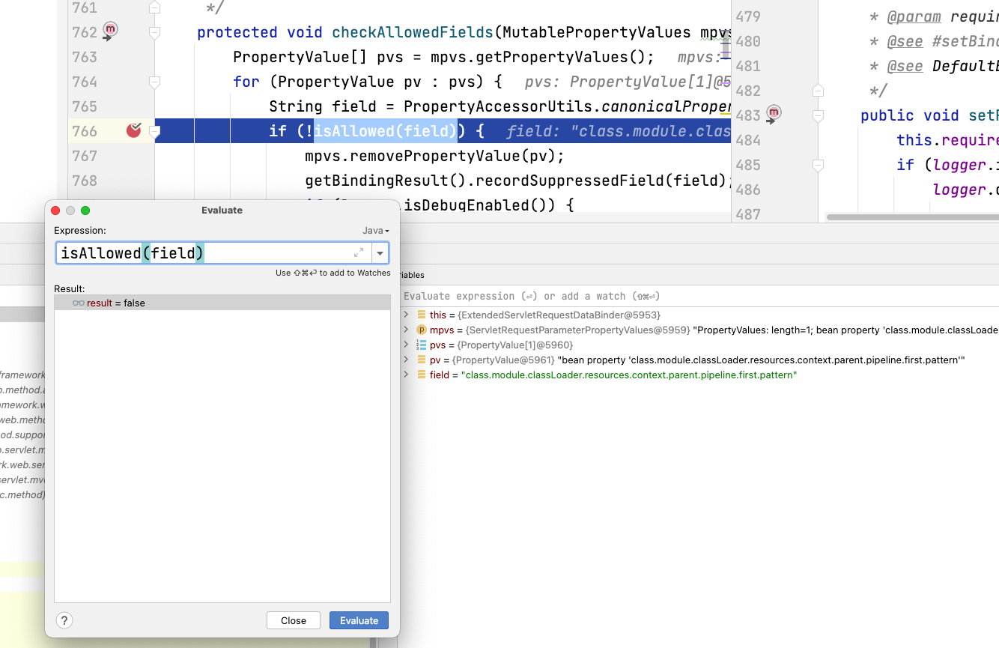

# Hotfix for Spring RCE 2022.3.31

## Usage

1. Backup your application.
2. Download `spring-rce-2022-03-hotfix-all.jar` from GitHub release or build from source code.
3. `java -jar spring-rce-2022-03-hotfix-all.jar <the jar or directory to be patched>`

## How it works

It uses bytecode manipulation to replace vulnerable Spring `org.springframework.validation.DataBinder.getDisallowedFields()` with:

```
    String[] fallback = PropertyAccessorUtils.canonicalPropertyNames(new String[]{"class.*", "Class.*", "*.class.*", "*.Class.*"});
    if (this.disallowedFields == null) {
        return fallback;
    } else {
        String[] ret = new String[disallowedFields.length + fallback.length];
        System.arraycopy(disallowedFields, 0, ret, 0, disallowedFields.length);
        System.arraycopy(fallback, 0, ret, disallowedFields.length, fallback.length);
        return ret;
    }
```

Example output:

```
$ java -jar spring-rce-2022-03-hotfix-all.jar ~/Downloads/demo
Found vulnerable DataBinder.class in demo-0.0.1-SNAPSHOT.jar-spring-context-5.3.17.jar, patching...
Successfully patched /Users/zhb/Downloads/demo/target/demo-0.0.1-SNAPSHOT.jar.
Vulnerability not found in /Users/zhb/Downloads/demo/.mvn/wrapper/maven-wrapper.jar.
```

After patching, `isAllowed()` returns `false` for the malicious payload containing `class.*`:


